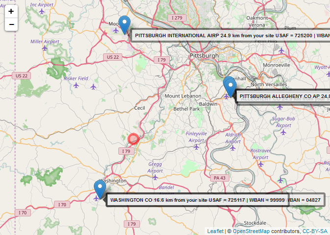
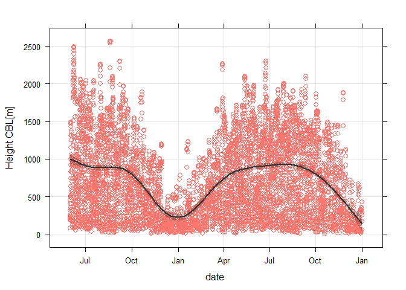
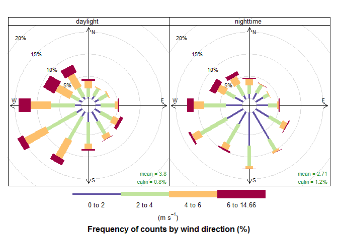
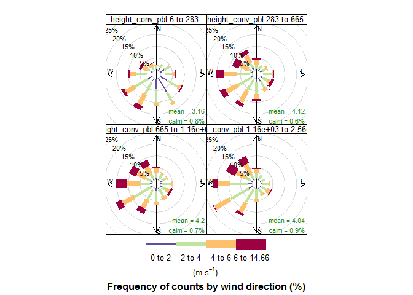
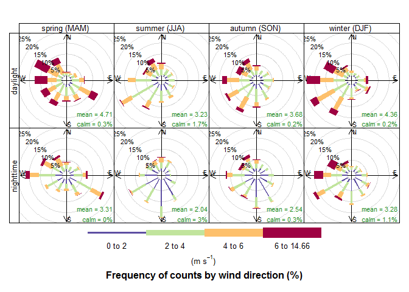

Example - Pittsburg International Airport
================

Example of usage - Interactive Single Site
------------------------------------------

To use rmet2, you will type the following into the console:

``` r
library(rmet2)
```

    ## $rmet.aermet
    ## [1] "aermet"
    ## 
    ## $rmet.aerminute
    ## [1] "aerminute"
    ## 
    ## $rmet.aersurface
    ## [1] "aersurface"
    ## 
    ## $rmet.desc
    ## list()
    ## 
    ## $rmet.desc.author
    ## [1] "\"James Durant <hzd3@cdc.gov> [aut, cre]\""
    ## 
    ## $rmet.desc.license
    ## [1] "MIT"
    ## 
    ## $rmet.install.args
    ## [1] ""
    ## 
    ## $rmet.name
    ## [1] "rmet"
    ## 
    ## $rmet.noaa.site
    ## [1] "http://www1.ncdc.noaa.gov/pub/data/"
    ## 
    ## $rmet.noaa.surfhist
    ## [1] "http://www1.ncdc.noaa.gov/pub/data/noaa/isd-history.txt"

For a single site, most users will develop and run a script to process the data. First, we need to identify NOAA surface stations near the site of interest.

``` r
mapstation("Canonsburg, PA", labels="text")
```

    ## Information from URL : http://maps.googleapis.com/maps/api/geocode/json?address=Canonsburg,%20PA&sensor=false



Data for the project:

-   We select Pittsburg International Airport as our surface station (USAF ID=725200, WBAN = 94823).

-   We will use upper air data from Corpus Christi (WMO = 72520)

-   We will run AERMET for the June 1, 2012 - December, 31, 2013 (1.5 years)

-   We will process using AERMINUTE

-   We will run the project in directory "C:/rmet2/pitt"

### Install Aermet, Aerminute, and Aersurface

`installAM` attempts to download the current versions of Aermet, Aersurface and Aerminute from the [SCRAM Meteorological Processors website](https://www3.epa.gov/scram001/metobsdata_procaccprogs.htm) and [SCRAM Related Programs Website](https://www3.epa.gov/scram001/dispersion_related.htm). After downloading, the program sets the location of aermet, aerminute, and aersurface executables in the `options()`. Links at these websites change, so `installAM` can be set just to configure `options` - see `?installAM`.

``` r
installAM()
```

    ## [1] "downloading aermet"
    ## [1] "downloading aerminute"
    ## [1] "downloading aersurface"

    ## NULL

This is the location of the executables.

``` r
sapply(c("aermet", "aerminute", "aersurface"), getOption)
```

    ##                                   aermet 
    ##               "C:/aermet_exe/aermet.exe" 
    ##                                aerminute 
    ## "C:/aerminute_15272/aerminute_15272.exe" 
    ##                               aersurface 
    ##       "C:/aersurface_exe/aersurface.exe"

### Create rmet object

``` r
kpit <- createMetProject(
  project_Name = "PITTSBURG INT AP",
   project_Dir="C:/rmet2/pitt/",
  start_Date = lubridate::mdy_hm("06/01/2012 00:00", tz="Etc/GMT+5"),
  end_Date = lubridate::mdy_hm("12/31/2013 23:00", tz="Etc/GMT+5"),
  surf_UTC = -5,
  surf_WBAN = 94823,
  surf_USAF = 725200,
  surf_Call="KPIT",
  surf_Latitude = 40.4846,
  surf_Longitude = -80.2144,
  surf_Elevation = 367,
  surf_AnenometerHeight = 10,
  ua_WMO=72520,
  ua_UTC=-5,
  ua_Latitude = 40.48,
  ua_Longitude = -80.21,
  ifg = "Y 07 28 2009",
  lc_File = "C:/rmet2/pitt/landuse/kpit_nlcd1992.tif",
  lc_Type = "NLCD1992",
  imp_File = NULL,
  imp_Type = NULL,
  cnpy_File = NULL,
  cnpy_Type = NULL,
  as_Snow = "Y",
  as_Arid = "N",
  as_Moisture = "A",
  as_Airport = "Y",
  as_Winter_NS ="",
  as_Winter_WS = "12 1 2",
  as_Spring ="3 4 5",
  as_Summer = "6 7 8",
  as_Autumn = "9 10 11")
```

    ## Warning in dir.create(project_Dir, recursive = FALSE): 'C:\rmet2\pitt'
    ## already exists

    ## Warning in dir.create(paste(project_Dir, "aersurface", sep = "/"),
    ## recursive = FALSE): 'C:\rmet2\pitt\\aersurface' already exists

The project is also save as an RDS file. If the RDS file is detected in the directory, `createMetProject` will automatically load that and issue a warning.

#### Download Data

Now we can progress to downloading data

``` r
downloadTD3505(kpit) # could combine into one step
```

    ## [1] "Checking if files have been downloaded"
    ## $`2012`
    ## [1] "http://www1.ncdc.noaa.gov/pub/data/noaa/2012/725200-94823-2012.gz"
    ## [2] "http://www1.ncdc.noaa.gov/pub/data/noaa/2013/725200-94823-2013.gz"
    ## 
    ## $`2013`
    ## [1] "http://www1.ncdc.noaa.gov/pub/data/noaa/2013/725200-94823-2013.gz"
    ## [2] "http://www1.ncdc.noaa.gov/pub/data/noaa/2014/725200-94823-2014.gz"
    ## 
    ## [1] FALSE
    ## [1] FALSE
    ## [1] "201301010500"
    ## [1] "201401010400"

    ## NULL

``` r
downloadTD6405(kpit)
```

    ## [1] "Checking if files have been downloaded"
    ## $`2012`
    ## [1] "http://www1.ncdc.noaa.gov/pub/data/asos-onemin/6405-2012/64050KPIT201206.dat"
    ## [2] "http://www1.ncdc.noaa.gov/pub/data/asos-onemin/6405-2012/64050KPIT201207.dat"
    ## [3] "http://www1.ncdc.noaa.gov/pub/data/asos-onemin/6405-2012/64050KPIT201208.dat"
    ## [4] "http://www1.ncdc.noaa.gov/pub/data/asos-onemin/6405-2012/64050KPIT201209.dat"
    ## [5] "http://www1.ncdc.noaa.gov/pub/data/asos-onemin/6405-2012/64050KPIT201210.dat"
    ## [6] "http://www1.ncdc.noaa.gov/pub/data/asos-onemin/6405-2012/64050KPIT201211.dat"
    ## [7] "http://www1.ncdc.noaa.gov/pub/data/asos-onemin/6405-2012/64050KPIT201212.dat"
    ## 
    ## $`2013`
    ##  [1] "http://www1.ncdc.noaa.gov/pub/data/asos-onemin/6405-2013/64050KPIT201301.dat"
    ##  [2] "http://www1.ncdc.noaa.gov/pub/data/asos-onemin/6405-2013/64050KPIT201302.dat"
    ##  [3] "http://www1.ncdc.noaa.gov/pub/data/asos-onemin/6405-2013/64050KPIT201303.dat"
    ##  [4] "http://www1.ncdc.noaa.gov/pub/data/asos-onemin/6405-2013/64050KPIT201304.dat"
    ##  [5] "http://www1.ncdc.noaa.gov/pub/data/asos-onemin/6405-2013/64050KPIT201305.dat"
    ##  [6] "http://www1.ncdc.noaa.gov/pub/data/asos-onemin/6405-2013/64050KPIT201306.dat"
    ##  [7] "http://www1.ncdc.noaa.gov/pub/data/asos-onemin/6405-2013/64050KPIT201307.dat"
    ##  [8] "http://www1.ncdc.noaa.gov/pub/data/asos-onemin/6405-2013/64050KPIT201308.dat"
    ##  [9] "http://www1.ncdc.noaa.gov/pub/data/asos-onemin/6405-2013/64050KPIT201309.dat"
    ## [10] "http://www1.ncdc.noaa.gov/pub/data/asos-onemin/6405-2013/64050KPIT201310.dat"
    ## [11] "http://www1.ncdc.noaa.gov/pub/data/asos-onemin/6405-2013/64050KPIT201311.dat"
    ## [12] "http://www1.ncdc.noaa.gov/pub/data/asos-onemin/6405-2013/64050KPIT201312.dat"
    ## 
    ## [1] "C:/rmet2/pitt//2012/64050KPIT201206.dat"
    ## [2] "C:/rmet2/pitt//2012/64050KPIT201207.dat"
    ## [3] "C:/rmet2/pitt//2012/64050KPIT201208.dat"
    ## [4] "C:/rmet2/pitt//2012/64050KPIT201209.dat"
    ## [5] "C:/rmet2/pitt//2012/64050KPIT201210.dat"
    ## [6] "C:/rmet2/pitt//2012/64050KPIT201211.dat"
    ## [7] "C:/rmet2/pitt//2012/64050KPIT201212.dat"
    ## [1] FALSE FALSE FALSE FALSE FALSE FALSE FALSE
    ##  [1] "C:/rmet2/pitt//2013/64050KPIT201301.dat"
    ##  [2] "C:/rmet2/pitt//2013/64050KPIT201302.dat"
    ##  [3] "C:/rmet2/pitt//2013/64050KPIT201303.dat"
    ##  [4] "C:/rmet2/pitt//2013/64050KPIT201304.dat"
    ##  [5] "C:/rmet2/pitt//2013/64050KPIT201305.dat"
    ##  [6] "C:/rmet2/pitt//2013/64050KPIT201306.dat"
    ##  [7] "C:/rmet2/pitt//2013/64050KPIT201307.dat"
    ##  [8] "C:/rmet2/pitt//2013/64050KPIT201308.dat"
    ##  [9] "C:/rmet2/pitt//2013/64050KPIT201309.dat"
    ## [10] "C:/rmet2/pitt//2013/64050KPIT201310.dat"
    ## [11] "C:/rmet2/pitt//2013/64050KPIT201311.dat"
    ## [12] "C:/rmet2/pitt//2013/64050KPIT201312.dat"
    ##  [1] FALSE FALSE FALSE FALSE FALSE FALSE FALSE FALSE FALSE FALSE FALSE
    ## [12] FALSE

    ## NULL

``` r
downloadTD6401(kpit)
```

    ## [1] "Checking if files have been downloaded"
    ## $`2012`
    ## [1] "http://www1.ncdc.noaa.gov/pub/data/asos-fivemin/6401-2012/64010KPIT201206.dat"
    ## [2] "http://www1.ncdc.noaa.gov/pub/data/asos-fivemin/6401-2012/64010KPIT201207.dat"
    ## [3] "http://www1.ncdc.noaa.gov/pub/data/asos-fivemin/6401-2012/64010KPIT201208.dat"
    ## [4] "http://www1.ncdc.noaa.gov/pub/data/asos-fivemin/6401-2012/64010KPIT201209.dat"
    ## [5] "http://www1.ncdc.noaa.gov/pub/data/asos-fivemin/6401-2012/64010KPIT201210.dat"
    ## [6] "http://www1.ncdc.noaa.gov/pub/data/asos-fivemin/6401-2012/64010KPIT201211.dat"
    ## [7] "http://www1.ncdc.noaa.gov/pub/data/asos-fivemin/6401-2012/64010KPIT201212.dat"
    ## 
    ## $`2013`
    ##  [1] "http://www1.ncdc.noaa.gov/pub/data/asos-fivemin/6401-2013/64010KPIT201301.dat"
    ##  [2] "http://www1.ncdc.noaa.gov/pub/data/asos-fivemin/6401-2013/64010KPIT201302.dat"
    ##  [3] "http://www1.ncdc.noaa.gov/pub/data/asos-fivemin/6401-2013/64010KPIT201303.dat"
    ##  [4] "http://www1.ncdc.noaa.gov/pub/data/asos-fivemin/6401-2013/64010KPIT201304.dat"
    ##  [5] "http://www1.ncdc.noaa.gov/pub/data/asos-fivemin/6401-2013/64010KPIT201305.dat"
    ##  [6] "http://www1.ncdc.noaa.gov/pub/data/asos-fivemin/6401-2013/64010KPIT201306.dat"
    ##  [7] "http://www1.ncdc.noaa.gov/pub/data/asos-fivemin/6401-2013/64010KPIT201307.dat"
    ##  [8] "http://www1.ncdc.noaa.gov/pub/data/asos-fivemin/6401-2013/64010KPIT201308.dat"
    ##  [9] "http://www1.ncdc.noaa.gov/pub/data/asos-fivemin/6401-2013/64010KPIT201309.dat"
    ## [10] "http://www1.ncdc.noaa.gov/pub/data/asos-fivemin/6401-2013/64010KPIT201310.dat"
    ## [11] "http://www1.ncdc.noaa.gov/pub/data/asos-fivemin/6401-2013/64010KPIT201311.dat"
    ## [12] "http://www1.ncdc.noaa.gov/pub/data/asos-fivemin/6401-2013/64010KPIT201312.dat"
    ## 
    ## [1] "C:/rmet2/pitt//2012/64010KPIT201206.dat"
    ## [2] "C:/rmet2/pitt//2012/64010KPIT201207.dat"
    ## [3] "C:/rmet2/pitt//2012/64010KPIT201208.dat"
    ## [4] "C:/rmet2/pitt//2012/64010KPIT201209.dat"
    ## [5] "C:/rmet2/pitt//2012/64010KPIT201210.dat"
    ## [6] "C:/rmet2/pitt//2012/64010KPIT201211.dat"
    ## [7] "C:/rmet2/pitt//2012/64010KPIT201212.dat"
    ## [1] FALSE FALSE FALSE FALSE FALSE FALSE FALSE
    ##  [1] "C:/rmet2/pitt//2013/64010KPIT201301.dat"
    ##  [2] "C:/rmet2/pitt//2013/64010KPIT201302.dat"
    ##  [3] "C:/rmet2/pitt//2013/64010KPIT201303.dat"
    ##  [4] "C:/rmet2/pitt//2013/64010KPIT201304.dat"
    ##  [5] "C:/rmet2/pitt//2013/64010KPIT201305.dat"
    ##  [6] "C:/rmet2/pitt//2013/64010KPIT201306.dat"
    ##  [7] "C:/rmet2/pitt//2013/64010KPIT201307.dat"
    ##  [8] "C:/rmet2/pitt//2013/64010KPIT201308.dat"
    ##  [9] "C:/rmet2/pitt//2013/64010KPIT201309.dat"
    ## [10] "C:/rmet2/pitt//2013/64010KPIT201310.dat"
    ## [11] "C:/rmet2/pitt//2013/64010KPIT201311.dat"
    ## [12] "C:/rmet2/pitt//2013/64010KPIT201312.dat"
    ##  [1] FALSE FALSE FALSE FALSE FALSE FALSE FALSE FALSE FALSE FALSE FALSE
    ## [12] FALSE

    ## NULL

``` r
downloadFSL(kpit)
```

    ## NULL

#### Create Input Files

Two functions are used to create input strings for the AERMET and AERSURFACE and then write them to the appropriate directories

``` r
kpit <- createInput(kpit) # probably should combine this into one step
```

    ## [1] "Writing AERMINUTE inpute files:\n"

``` r
kpit <- writeInputFile(kpit, c("aerminute", "aersurface"))
```

### Process Data

``` r
kpit <- processMet(kpit, processor=c("aerminute", "aersurface", "aermet1", "aermet2", "aermet3"))
makeFinal.rmet(kpit, "kpit94823")
```

### Check Data

``` r
kpit_surf <- surfaceReader(sfile=paste(kpit$project_Dir, "kpit94823.sfc", sep="/"), kpit)
scatterPlot(kpit_surf, x="date", y="height_conv_pbl", smooth=TRUE,
            ylab = "Height CBL[m]")
```

    ## Warning in arrange_impl(.data, dots): '.Random.seed' is not an integer
    ## vector but of type 'NULL', so ignored



``` r
windRose(kpit_surf, lat = kpit$surf_Latitude, long = kpit$surf_Longitude, type="daylight")
```



``` r
windRose(kpit_surf, type = "height_conv_pbl")
```



``` r
windRose(kpit_surf, type = c("season","daylight"), lat = kpit$surf_Latitude, long = kpit$surf_Longitude)
```


