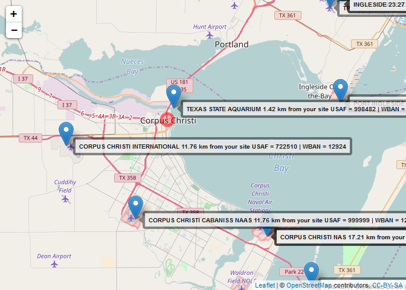

rmet2
================

Background
----------

This package is designed to assist running US EPA's Meteorological Processors, [AERMINUTE](https://www3.epa.gov/scram001/metobsdata_procaccprogs.htm), [AERSURFACE](https://www3.epa.gov/ttn/scram/dispersion_related.htm#aersurface), and [AERMET](https://www3.epa.gov/scram001/metobsdata_procaccprogs.htm). Rmet2 provides the following features:

-   Automatic Downloading of Meteorological Data from National Oceonographic and Atmospheric Administration (NOAA) websites.

-   Scripted set up of runstream input files to assist in reproducibility.

-   Caputuring output runstreams and files and producing tables and figures useful for air dispersion modelers to perform quality assurance checks on intermediate and final outputs of the meteorological preprocessors.

The package is designed to work with [R](www.r-project.org).

Installation
------------

In R, the following script will check for, and if needed, install the package [devtools](https://cran.r-project.org/web/packages/devtools/index.html), and then attempt to install rmet2 to your system. You will only have to install rmet2 once on your system, so for normal day-to-day use you will not need to run the installation script:

``` r
if(!"devtools" %in% installed.packages()) install.pacakges(devtools)
if(!"rmet2" %in% installed.packages()) devtools::install_git("https://github.com/YoJimboDurant/rmet2")
```

TO use rmet2, you will type the following into the console:

``` r
library(rmet2)
```

    ## $rmet.aermet
    ## [1] "aermet"
    ## 
    ## $rmet.aerminute
    ## [1] "aerminute"
    ## 
    ## $rmet.aersurface
    ## [1] "aersurface"
    ## 
    ## $rmet.desc
    ## list()
    ## 
    ## $rmet.desc.author
    ## [1] "\"James Durant <hzd3@cdc.gov> [aut, cre]\""
    ## 
    ## $rmet.desc.license
    ## [1] "MIT"
    ## 
    ## $rmet.install.args
    ## [1] ""
    ## 
    ## $rmet.name
    ## [1] "rmet"
    ## 
    ## $rmet.noaa.site
    ## [1] "http://www1.ncdc.noaa.gov/pub/data/"
    ## 
    ## $rmet.noaa.surfhist
    ## [1] "http://www1.ncdc.noaa.gov/pub/data/noaa/isd-history.txt"

Example of usage - Interactive Single Site
------------------------------------------

For a single site, most users will develop and run a script to process the data. First, we need to identify NOAA surface stations near the site of interest.

``` r
mapstation("Corpus Christi, TX", labels="text")
```

    ## Information from URL : http://maps.googleapis.com/maps/api/geocode/json?address=Corpus%20Christi,%20TX&sensor=false



Data for the project:

-   We select Corpus Christi International Airport as our surface station (USAF ID=722510, WBAN = 12924).

-   We will use upper air data from Corpus Christi (WBAN = 12924, WMO = 72251)

-   We will run AERMET for the January 1, 2009 - December, 31, 2013 (5 years)

-   We will process using AERMINUTE

-   For purposes of demostration, we will run the project in directory "C:/temp/CC"

### Install Aermet, Aerminute, and Aersurface

`installAM` attempts to download the current versions of Aermet, Aersurface and Aerminute from the [SCRAM Meteorological Processors website](https://www3.epa.gov/scram001/metobsdata_procaccprogs.htm) and [SCRAM Related Programs Website](https://www3.epa.gov/scram001/dispersion_related.htm). After downloading, the program sets the location of aermet, aerminute, and aersurface executables in the `options()`. Links at these websites change, so `installAM` can be set just to configure `options` - see `?installAM`.

``` r
installAM()
```

    ## [1] "downloading aermet"
    ## [1] "downloading aerminute"
    ## [1] "downloading aersurface"

    ## NULL

This is the location of the executables.

``` r
sapply(c("aermet", "aerminute", "aersurface"), getOption)
```

    ##                                   aermet 
    ##               "C:/aermet_exe/aermet.exe" 
    ##                                aerminute 
    ## "C:/aerminute_15272/aerminute_15272.exe" 
    ##                               aersurface 
    ##       "C:/aersurface_exe/aersurface.exe"

### Create rmet object

``` r
kcrp <- createMetProject(
  project_Name = "CORPUS CHRISTI AP",
   project_Dir="C:/temp/cc",
  start_Date = lubridate::mdy_hm("01/01/2009 00:00", tz="Etc/GMT+6"),
  end_Date = lubridate::mdy_hm("12/31/2013 23:00", tz="Etc/GMT+6"),
  surf_UTC = -6,
  surf_WBAN = 12924,
  surf_USAF = 722510,
  surf_Call="KCRP",
  surf_Latitude = 27.7742,
  surf_Longitude = -97.5122,
  surf_Elevation = 13,
  surf_AnenometerHeight = 10,
  ua_WMO=72251,
  ua_UTC=-6,
  ua_Latitude = 27.77,
  ua_Longitude = -97.50,
  ifg = "Y 02 13 2006",
  lc_File = "C:\\temp\\cc\\landuse\\texas_se.nlcd.tif",
  lc_Type = "NLCD1992",
  imp_File = NULL,
  imp_Type = NULL,
  cnpy_File = NULL,
  cnpy_Type = NULL,
  as_Snow = "N",
  as_Arid = "Y",
  as_Moisture = "A",
  as_Airport = "Y",
  as_Winter_NS ="12 1 2",
  as_Winter_WS = NULL,
  as_Spring ="3 4 5",
  as_Summer = "6 7 8",
  as_Autumn = "9 10 11")
```

    ## Warning in dir.create(paste(project_Dir, "aersurface", sep = "/"),
    ## recursive = FALSE): 'C:\temp\cc\aersurface' already exists

The project is also save as an RDS file. If the RDS file is detected in the directory, `createMetProject` will automatically load that and issue a warning.

#### Download Data

Now we can progress to downloading data

``` r
downloadTD3505(kcrp) # could combine into one step
```

    ## [1] "Checking if files have been downloaded"
    ## $`2009`
    ## [1] "http://www1.ncdc.noaa.gov/pub/data/noaa/2009/722510-12924-2009.gz"
    ## [2] "http://www1.ncdc.noaa.gov/pub/data/noaa/2010/722510-12924-2010.gz"
    ## 
    ## $`2010`
    ## [1] "http://www1.ncdc.noaa.gov/pub/data/noaa/2010/722510-12924-2010.gz"
    ## [2] "http://www1.ncdc.noaa.gov/pub/data/noaa/2011/722510-12924-2011.gz"
    ## 
    ## $`2011`
    ## [1] "http://www1.ncdc.noaa.gov/pub/data/noaa/2011/722510-12924-2011.gz"
    ## [2] "http://www1.ncdc.noaa.gov/pub/data/noaa/2012/722510-12924-2012.gz"
    ## 
    ## $`2012`
    ## [1] "http://www1.ncdc.noaa.gov/pub/data/noaa/2012/722510-12924-2012.gz"
    ## [2] "http://www1.ncdc.noaa.gov/pub/data/noaa/2013/722510-12924-2013.gz"
    ## 
    ## $`2013`
    ## [1] "http://www1.ncdc.noaa.gov/pub/data/noaa/2013/722510-12924-2013.gz"
    ## [2] "http://www1.ncdc.noaa.gov/pub/data/noaa/2014/722510-12924-2014.gz"
    ## 
    ## [1] "201001010600"
    ## [1] "201101010600"
    ## [1] "201201010600"
    ## [1] "201301010600"
    ## [1] "201401010500"

    ## NULL

``` r
downloadTD6405(kcrp)
```

    ## [1] "Checking if files have been downloaded"
    ## $`2009`
    ##  [1] "http://www1.ncdc.noaa.gov/pub/data/asos-onemin/6405-2009/64050KCRP200901.dat"
    ##  [2] "http://www1.ncdc.noaa.gov/pub/data/asos-onemin/6405-2009/64050KCRP200902.dat"
    ##  [3] "http://www1.ncdc.noaa.gov/pub/data/asos-onemin/6405-2009/64050KCRP200903.dat"
    ##  [4] "http://www1.ncdc.noaa.gov/pub/data/asos-onemin/6405-2009/64050KCRP200904.dat"
    ##  [5] "http://www1.ncdc.noaa.gov/pub/data/asos-onemin/6405-2009/64050KCRP200905.dat"
    ##  [6] "http://www1.ncdc.noaa.gov/pub/data/asos-onemin/6405-2009/64050KCRP200906.dat"
    ##  [7] "http://www1.ncdc.noaa.gov/pub/data/asos-onemin/6405-2009/64050KCRP200907.dat"
    ##  [8] "http://www1.ncdc.noaa.gov/pub/data/asos-onemin/6405-2009/64050KCRP200908.dat"
    ##  [9] "http://www1.ncdc.noaa.gov/pub/data/asos-onemin/6405-2009/64050KCRP200909.dat"
    ## [10] "http://www1.ncdc.noaa.gov/pub/data/asos-onemin/6405-2009/64050KCRP200910.dat"
    ## [11] "http://www1.ncdc.noaa.gov/pub/data/asos-onemin/6405-2009/64050KCRP200911.dat"
    ## [12] "http://www1.ncdc.noaa.gov/pub/data/asos-onemin/6405-2009/64050KCRP200912.dat"
    ## 
    ## $`2010`
    ##  [1] "http://www1.ncdc.noaa.gov/pub/data/asos-onemin/6405-2010/64050KCRP201001.dat"
    ##  [2] "http://www1.ncdc.noaa.gov/pub/data/asos-onemin/6405-2010/64050KCRP201002.dat"
    ##  [3] "http://www1.ncdc.noaa.gov/pub/data/asos-onemin/6405-2010/64050KCRP201003.dat"
    ##  [4] "http://www1.ncdc.noaa.gov/pub/data/asos-onemin/6405-2010/64050KCRP201004.dat"
    ##  [5] "http://www1.ncdc.noaa.gov/pub/data/asos-onemin/6405-2010/64050KCRP201005.dat"
    ##  [6] "http://www1.ncdc.noaa.gov/pub/data/asos-onemin/6405-2010/64050KCRP201006.dat"
    ##  [7] "http://www1.ncdc.noaa.gov/pub/data/asos-onemin/6405-2010/64050KCRP201007.dat"
    ##  [8] "http://www1.ncdc.noaa.gov/pub/data/asos-onemin/6405-2010/64050KCRP201008.dat"
    ##  [9] "http://www1.ncdc.noaa.gov/pub/data/asos-onemin/6405-2010/64050KCRP201009.dat"
    ## [10] "http://www1.ncdc.noaa.gov/pub/data/asos-onemin/6405-2010/64050KCRP201010.dat"
    ## [11] "http://www1.ncdc.noaa.gov/pub/data/asos-onemin/6405-2010/64050KCRP201011.dat"
    ## [12] "http://www1.ncdc.noaa.gov/pub/data/asos-onemin/6405-2010/64050KCRP201012.dat"
    ## 
    ## $`2011`
    ##  [1] "http://www1.ncdc.noaa.gov/pub/data/asos-onemin/6405-2011/64050KCRP201101.dat"
    ##  [2] "http://www1.ncdc.noaa.gov/pub/data/asos-onemin/6405-2011/64050KCRP201102.dat"
    ##  [3] "http://www1.ncdc.noaa.gov/pub/data/asos-onemin/6405-2011/64050KCRP201103.dat"
    ##  [4] "http://www1.ncdc.noaa.gov/pub/data/asos-onemin/6405-2011/64050KCRP201104.dat"
    ##  [5] "http://www1.ncdc.noaa.gov/pub/data/asos-onemin/6405-2011/64050KCRP201105.dat"
    ##  [6] "http://www1.ncdc.noaa.gov/pub/data/asos-onemin/6405-2011/64050KCRP201106.dat"
    ##  [7] "http://www1.ncdc.noaa.gov/pub/data/asos-onemin/6405-2011/64050KCRP201107.dat"
    ##  [8] "http://www1.ncdc.noaa.gov/pub/data/asos-onemin/6405-2011/64050KCRP201108.dat"
    ##  [9] "http://www1.ncdc.noaa.gov/pub/data/asos-onemin/6405-2011/64050KCRP201109.dat"
    ## [10] "http://www1.ncdc.noaa.gov/pub/data/asos-onemin/6405-2011/64050KCRP201110.dat"
    ## [11] "http://www1.ncdc.noaa.gov/pub/data/asos-onemin/6405-2011/64050KCRP201111.dat"
    ## [12] "http://www1.ncdc.noaa.gov/pub/data/asos-onemin/6405-2011/64050KCRP201112.dat"
    ## 
    ## $`2012`
    ##  [1] "http://www1.ncdc.noaa.gov/pub/data/asos-onemin/6405-2012/64050KCRP201201.dat"
    ##  [2] "http://www1.ncdc.noaa.gov/pub/data/asos-onemin/6405-2012/64050KCRP201202.dat"
    ##  [3] "http://www1.ncdc.noaa.gov/pub/data/asos-onemin/6405-2012/64050KCRP201203.dat"
    ##  [4] "http://www1.ncdc.noaa.gov/pub/data/asos-onemin/6405-2012/64050KCRP201204.dat"
    ##  [5] "http://www1.ncdc.noaa.gov/pub/data/asos-onemin/6405-2012/64050KCRP201205.dat"
    ##  [6] "http://www1.ncdc.noaa.gov/pub/data/asos-onemin/6405-2012/64050KCRP201206.dat"
    ##  [7] "http://www1.ncdc.noaa.gov/pub/data/asos-onemin/6405-2012/64050KCRP201207.dat"
    ##  [8] "http://www1.ncdc.noaa.gov/pub/data/asos-onemin/6405-2012/64050KCRP201208.dat"
    ##  [9] "http://www1.ncdc.noaa.gov/pub/data/asos-onemin/6405-2012/64050KCRP201209.dat"
    ## [10] "http://www1.ncdc.noaa.gov/pub/data/asos-onemin/6405-2012/64050KCRP201210.dat"
    ## [11] "http://www1.ncdc.noaa.gov/pub/data/asos-onemin/6405-2012/64050KCRP201211.dat"
    ## [12] "http://www1.ncdc.noaa.gov/pub/data/asos-onemin/6405-2012/64050KCRP201212.dat"
    ## 
    ## $`2013`
    ##  [1] "http://www1.ncdc.noaa.gov/pub/data/asos-onemin/6405-2013/64050KCRP201301.dat"
    ##  [2] "http://www1.ncdc.noaa.gov/pub/data/asos-onemin/6405-2013/64050KCRP201302.dat"
    ##  [3] "http://www1.ncdc.noaa.gov/pub/data/asos-onemin/6405-2013/64050KCRP201303.dat"
    ##  [4] "http://www1.ncdc.noaa.gov/pub/data/asos-onemin/6405-2013/64050KCRP201304.dat"
    ##  [5] "http://www1.ncdc.noaa.gov/pub/data/asos-onemin/6405-2013/64050KCRP201305.dat"
    ##  [6] "http://www1.ncdc.noaa.gov/pub/data/asos-onemin/6405-2013/64050KCRP201306.dat"
    ##  [7] "http://www1.ncdc.noaa.gov/pub/data/asos-onemin/6405-2013/64050KCRP201307.dat"
    ##  [8] "http://www1.ncdc.noaa.gov/pub/data/asos-onemin/6405-2013/64050KCRP201308.dat"
    ##  [9] "http://www1.ncdc.noaa.gov/pub/data/asos-onemin/6405-2013/64050KCRP201309.dat"
    ## [10] "http://www1.ncdc.noaa.gov/pub/data/asos-onemin/6405-2013/64050KCRP201310.dat"
    ## [11] "http://www1.ncdc.noaa.gov/pub/data/asos-onemin/6405-2013/64050KCRP201311.dat"
    ## [12] "http://www1.ncdc.noaa.gov/pub/data/asos-onemin/6405-2013/64050KCRP201312.dat"

    ## NULL

``` r
downloadTD6401(kcrp)
```

    ## [1] "Checking if files have been downloaded"
    ## $`2009`
    ##  [1] "http://www1.ncdc.noaa.gov/pub/data/asos-fivemin/6401-2009/64010KCRP200901.dat"
    ##  [2] "http://www1.ncdc.noaa.gov/pub/data/asos-fivemin/6401-2009/64010KCRP200902.dat"
    ##  [3] "http://www1.ncdc.noaa.gov/pub/data/asos-fivemin/6401-2009/64010KCRP200903.dat"
    ##  [4] "http://www1.ncdc.noaa.gov/pub/data/asos-fivemin/6401-2009/64010KCRP200904.dat"
    ##  [5] "http://www1.ncdc.noaa.gov/pub/data/asos-fivemin/6401-2009/64010KCRP200905.dat"
    ##  [6] "http://www1.ncdc.noaa.gov/pub/data/asos-fivemin/6401-2009/64010KCRP200906.dat"
    ##  [7] "http://www1.ncdc.noaa.gov/pub/data/asos-fivemin/6401-2009/64010KCRP200907.dat"
    ##  [8] "http://www1.ncdc.noaa.gov/pub/data/asos-fivemin/6401-2009/64010KCRP200908.dat"
    ##  [9] "http://www1.ncdc.noaa.gov/pub/data/asos-fivemin/6401-2009/64010KCRP200909.dat"
    ## [10] "http://www1.ncdc.noaa.gov/pub/data/asos-fivemin/6401-2009/64010KCRP200910.dat"
    ## [11] "http://www1.ncdc.noaa.gov/pub/data/asos-fivemin/6401-2009/64010KCRP200911.dat"
    ## [12] "http://www1.ncdc.noaa.gov/pub/data/asos-fivemin/6401-2009/64010KCRP200912.dat"
    ## 
    ## $`2010`
    ##  [1] "http://www1.ncdc.noaa.gov/pub/data/asos-fivemin/6401-2010/64010KCRP201001.dat"
    ##  [2] "http://www1.ncdc.noaa.gov/pub/data/asos-fivemin/6401-2010/64010KCRP201002.dat"
    ##  [3] "http://www1.ncdc.noaa.gov/pub/data/asos-fivemin/6401-2010/64010KCRP201003.dat"
    ##  [4] "http://www1.ncdc.noaa.gov/pub/data/asos-fivemin/6401-2010/64010KCRP201004.dat"
    ##  [5] "http://www1.ncdc.noaa.gov/pub/data/asos-fivemin/6401-2010/64010KCRP201005.dat"
    ##  [6] "http://www1.ncdc.noaa.gov/pub/data/asos-fivemin/6401-2010/64010KCRP201006.dat"
    ##  [7] "http://www1.ncdc.noaa.gov/pub/data/asos-fivemin/6401-2010/64010KCRP201007.dat"
    ##  [8] "http://www1.ncdc.noaa.gov/pub/data/asos-fivemin/6401-2010/64010KCRP201008.dat"
    ##  [9] "http://www1.ncdc.noaa.gov/pub/data/asos-fivemin/6401-2010/64010KCRP201009.dat"
    ## [10] "http://www1.ncdc.noaa.gov/pub/data/asos-fivemin/6401-2010/64010KCRP201010.dat"
    ## [11] "http://www1.ncdc.noaa.gov/pub/data/asos-fivemin/6401-2010/64010KCRP201011.dat"
    ## [12] "http://www1.ncdc.noaa.gov/pub/data/asos-fivemin/6401-2010/64010KCRP201012.dat"
    ## 
    ## $`2011`
    ##  [1] "http://www1.ncdc.noaa.gov/pub/data/asos-fivemin/6401-2011/64010KCRP201101.dat"
    ##  [2] "http://www1.ncdc.noaa.gov/pub/data/asos-fivemin/6401-2011/64010KCRP201102.dat"
    ##  [3] "http://www1.ncdc.noaa.gov/pub/data/asos-fivemin/6401-2011/64010KCRP201103.dat"
    ##  [4] "http://www1.ncdc.noaa.gov/pub/data/asos-fivemin/6401-2011/64010KCRP201104.dat"
    ##  [5] "http://www1.ncdc.noaa.gov/pub/data/asos-fivemin/6401-2011/64010KCRP201105.dat"
    ##  [6] "http://www1.ncdc.noaa.gov/pub/data/asos-fivemin/6401-2011/64010KCRP201106.dat"
    ##  [7] "http://www1.ncdc.noaa.gov/pub/data/asos-fivemin/6401-2011/64010KCRP201107.dat"
    ##  [8] "http://www1.ncdc.noaa.gov/pub/data/asos-fivemin/6401-2011/64010KCRP201108.dat"
    ##  [9] "http://www1.ncdc.noaa.gov/pub/data/asos-fivemin/6401-2011/64010KCRP201109.dat"
    ## [10] "http://www1.ncdc.noaa.gov/pub/data/asos-fivemin/6401-2011/64010KCRP201110.dat"
    ## [11] "http://www1.ncdc.noaa.gov/pub/data/asos-fivemin/6401-2011/64010KCRP201111.dat"
    ## [12] "http://www1.ncdc.noaa.gov/pub/data/asos-fivemin/6401-2011/64010KCRP201112.dat"
    ## 
    ## $`2012`
    ##  [1] "http://www1.ncdc.noaa.gov/pub/data/asos-fivemin/6401-2012/64010KCRP201201.dat"
    ##  [2] "http://www1.ncdc.noaa.gov/pub/data/asos-fivemin/6401-2012/64010KCRP201202.dat"
    ##  [3] "http://www1.ncdc.noaa.gov/pub/data/asos-fivemin/6401-2012/64010KCRP201203.dat"
    ##  [4] "http://www1.ncdc.noaa.gov/pub/data/asos-fivemin/6401-2012/64010KCRP201204.dat"
    ##  [5] "http://www1.ncdc.noaa.gov/pub/data/asos-fivemin/6401-2012/64010KCRP201205.dat"
    ##  [6] "http://www1.ncdc.noaa.gov/pub/data/asos-fivemin/6401-2012/64010KCRP201206.dat"
    ##  [7] "http://www1.ncdc.noaa.gov/pub/data/asos-fivemin/6401-2012/64010KCRP201207.dat"
    ##  [8] "http://www1.ncdc.noaa.gov/pub/data/asos-fivemin/6401-2012/64010KCRP201208.dat"
    ##  [9] "http://www1.ncdc.noaa.gov/pub/data/asos-fivemin/6401-2012/64010KCRP201209.dat"
    ## [10] "http://www1.ncdc.noaa.gov/pub/data/asos-fivemin/6401-2012/64010KCRP201210.dat"
    ## [11] "http://www1.ncdc.noaa.gov/pub/data/asos-fivemin/6401-2012/64010KCRP201211.dat"
    ## [12] "http://www1.ncdc.noaa.gov/pub/data/asos-fivemin/6401-2012/64010KCRP201212.dat"
    ## 
    ## $`2013`
    ##  [1] "http://www1.ncdc.noaa.gov/pub/data/asos-fivemin/6401-2013/64010KCRP201301.dat"
    ##  [2] "http://www1.ncdc.noaa.gov/pub/data/asos-fivemin/6401-2013/64010KCRP201302.dat"
    ##  [3] "http://www1.ncdc.noaa.gov/pub/data/asos-fivemin/6401-2013/64010KCRP201303.dat"
    ##  [4] "http://www1.ncdc.noaa.gov/pub/data/asos-fivemin/6401-2013/64010KCRP201304.dat"
    ##  [5] "http://www1.ncdc.noaa.gov/pub/data/asos-fivemin/6401-2013/64010KCRP201305.dat"
    ##  [6] "http://www1.ncdc.noaa.gov/pub/data/asos-fivemin/6401-2013/64010KCRP201306.dat"
    ##  [7] "http://www1.ncdc.noaa.gov/pub/data/asos-fivemin/6401-2013/64010KCRP201307.dat"
    ##  [8] "http://www1.ncdc.noaa.gov/pub/data/asos-fivemin/6401-2013/64010KCRP201308.dat"
    ##  [9] "http://www1.ncdc.noaa.gov/pub/data/asos-fivemin/6401-2013/64010KCRP201309.dat"
    ## [10] "http://www1.ncdc.noaa.gov/pub/data/asos-fivemin/6401-2013/64010KCRP201310.dat"
    ## [11] "http://www1.ncdc.noaa.gov/pub/data/asos-fivemin/6401-2013/64010KCRP201311.dat"
    ## [12] "http://www1.ncdc.noaa.gov/pub/data/asos-fivemin/6401-2013/64010KCRP201312.dat"

    ## NULL

``` r
downloadFSL(kcrp)
```

    ## NULL

#### Create Input Files

Two functions are used to create input strings for the AERMET and AERSURFACE and then write them to the appropriate directories

``` r
kcrp <- createInput(kcrp) # probably should combine this into one step
```

    ## [1] "Writing AERMINUTE inpute files:\n"

``` r
kcrp <- writeInputFile(kcrp, c("aerminute", "aersurface"))
```
